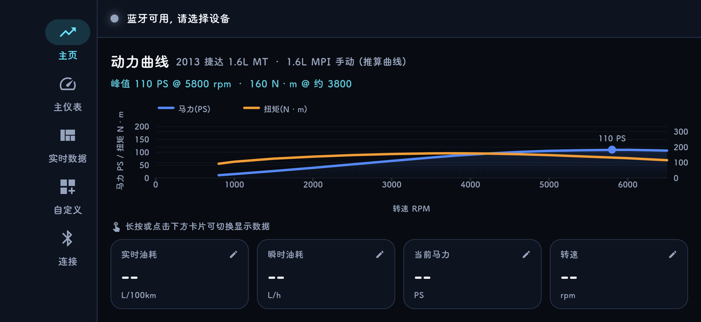
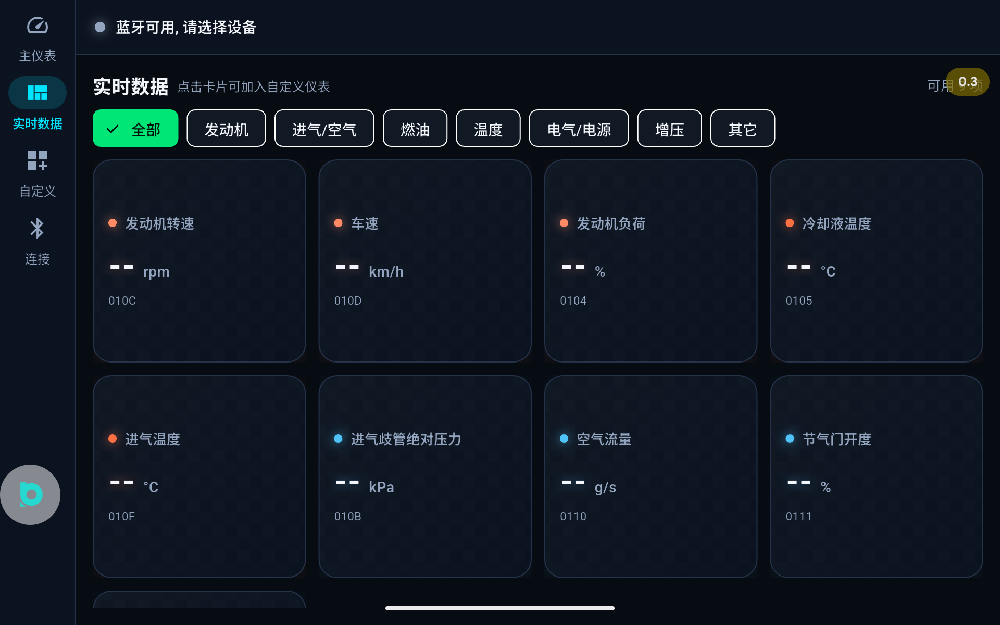
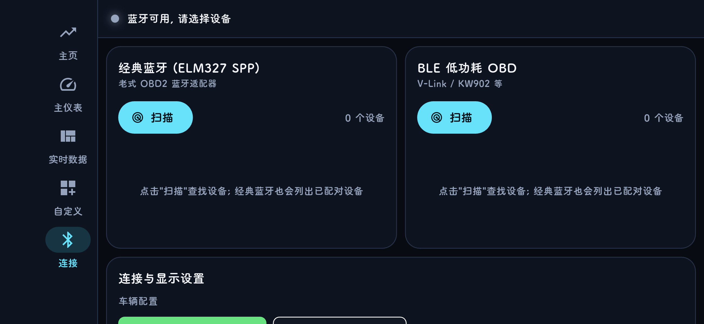

# OBD HUD Plus

一个横屏车载 OBD HUD 应用 / A landscape car OBD HUD app

> **开源协议 / License**: MIT License, 详见 `LICENSE`
>
> **最新下载 / Latest Download**: [OBD-HUD-Plus-v1.1.0.apk](https://github.com/chuangkoudexin/OBD-HUD/releases/download/v1.1.0/OBD-HUD-Plus-v1.1.0.apk)

---

## 🚗 功能 / Features

| 功能 | 说明 |
|------|------|
| **转速表** | 弯曲渐变色转速条 (1000-6000rpm, 每 500 换色, 5000/6000 红色) |
| **动力曲线** | 马力/扭矩双曲线图, 峰值标注 (H5 190PS / 捷达 110PS) |
| **多车型** | 2015 哈弗 H5 2.0T + 2013 捷达 1.6L MT (连接页切换) |
| **实时数据** | 转速/车速/水温/进气温度/涡轮压力/节气门/空气流量 等 |
| **油耗估算** | 由 MAF 空气流量推算 L/h 和 L/100km |
| **自定义** | 可编辑底部数据卡片, 长按/点击切换显示项 |
| **ELM 调试** | 连接页开启原始日志, 看 AT 命令收发 |
| **双通道** | 经典蓝牙 SPP + BLE 低功耗 |
| **自适应** | AndrOBD 风格协议轮询 + 自适应超时 + 错误恢复 |

## 📱 系统要求 / Requirements

- Android 6.0+ (API 23+)
- 蓝牙 4.0+ (经典 SPP 或 BLE)
- ELM327 OBD2 适配器

## 🛠 技术栈 / Tech Stack

| 层 | 技术 |
|------|------|
| 框架 | Flutter 3.29 / Dart 3.7 |
| 状态管理 | Provider |
| 蓝牙 | flutter_bluetooth_serial + flutter_blue_plus |
| 数据持久化 | SharedPreferences |
| CI | GitHub Actions (analyze → test → build) |

## 📦 项目结构 / Project Structure

```
lib/
├── core/           # 主题/配色/格式化
├── models/         # OBD PID 定义, 动力曲线模型, 自定义显示项
├── screens/        # 主页/仪表/实时/自定义/连接 五个页面
├── services/       # ELM327 会话, 蓝牙传输, 控制器, 设置
└── widgets/        # 转速表/马力图/数据卡片 组件
```

## 🔧 构建 / Build

```bash
# 获取依赖
flutter pub get

# 分析
flutter analyze

# 测试
flutter test

# 构建 APK
flutter build apk --release
```

## 📸 截图 / Screenshots

| 主页 | 主仪表 | 连接 |
|------|--------|------|
|  |  |  |

## 📋 ELM327 兼容性 / Compatibility

本应用参考了 [AndrOBD](https://github.com/fr3ts0n/AndrOBD) 的 ELM327 通信核心:

- ✅ 协议自动轮询 (CAN/ISO/KWP/J1850)
- ✅ 自适应超时 (1000ms)
- ✅ 错误自动恢复 (ATPC → ATSP → 重试)
- ✅ ECU 地址识别 + CAN 过滤
- ✅ 厂商 YMOBD 兼容 (AT+DEBUG_FLG / AT+CRYPT)

## 📄 开源协议 / License

MIT License - 详见 [LICENSE](LICENSE)
